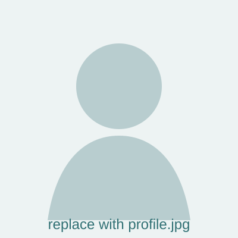

# Minimal Quarto personal website

## 1. Preview locally

Install Quarto, open a terminal in this folder, and run:

```bash
quarto preview
```

## 2. Edit the content

- `_quarto.yml`: navigation, website title, social links, footer.
- `index.qmd`: homepage.
- `research.qmd`, `publications.qmd`, `teaching.qmd`: main pages.
- `posts/`: one folder per post.
- `styles.scss`: colours, typography, spacing, and reusable CSS classes.

## 3. Replace the profile picture

Put your photo at `images/profile.jpg`, then change this line in `index.qmd`:

```markdown
{.hero-photo ...}
```

to:

```markdown
{.hero-photo ...}
```

## 4. Add the CV

Put the PDF at `files/cv.pdf`. The homepage link already points there.

## 5. Change the accent colour

At the top of `styles.scss`, edit:

```scss
$accent: #2f6f73;
```

## 6. Publish on GitHub Pages

For a user site such as `gbertagnolli.github.io`, place these files in the repository and run:

```bash
quarto publish gh-pages
```

Alternatively, use the official Quarto GitHub Actions workflow.
