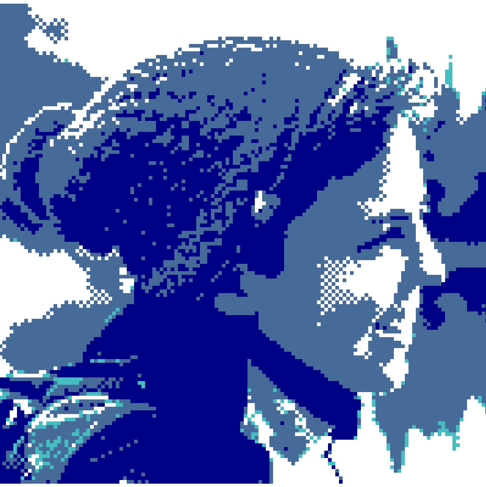

::: {.hero}
::: {.hero-profile}
{.hero-photo alt="Portrait of Giulia Bertagnolli"}

::: {.hero-icons}
<a href="mailto:giulia.bertagnolli@gmail.com" aria-label="Email" title="Email">
<svg viewBox="0 0 24 24" aria-hidden="true"><path d="M3 5h18a2 2 0 0 1 2 2v10a2 2 0 0 1-2 2H3a2 2 0 0 1-2-2V7a2 2 0 0 1 2-2Zm0 2 9 6 9-6H3Zm18 10V9.4l-8.45 5.63a1 1 0 0 1-1.1 0L3 9.4V17h18Z"/></svg>
</a>
<a href="files/cv.pdf" aria-label="Curriculum vitae" title="Curriculum vitae">
<svg viewBox="0 0 24 24" aria-hidden="true"><path d="M6 2h8l5 5v15H6a2 2 0 0 1-2-2V4a2 2 0 0 1 2-2Zm7 1.5V8h4.5L13 3.5ZM8 12h8v1.5H8V12Zm0 3h8v1.5H8V15Zm0 3h5v1.5H8V18Z"/></svg>
</a>
<a href="https://scholar.google.co.uk/citations?user=dSBvZYsAAAAJ" aria-label="Google Scholar" title="Google Scholar">
<svg viewBox="0 0 24 24" aria-hidden="true"><path d="M12 2 1 8l11 6 9-4.91V16h2V8L12 2Zm-7 9.18V16c0 2.5 3.13 4.5 7 4.5s7-2 7-4.5v-4.82L12 15l-7-3.82Z"/></svg>
</a>
<a href="https://orcid.org/0000-0001-8637-0632" aria-label="ORCID" title="ORCID" class="orcid-icon">
<svg viewBox="0 0 24 24" aria-hidden="true"><circle cx="12" cy="12" r="10"/><path class="orcid-cutout" d="M7.1 7.3h1.7v1.7H7.1V7.3Zm0 3h1.7v6.4H7.1v-6.4Zm3.4-3h4.1c3.1 0 5.2 1.8 5.2 4.7s-2.1 4.7-5.2 4.7h-4.1V7.3Zm1.8 1.6v6.2h2.2c2.1 0 3.4-1.1 3.4-3.1s-1.3-3.1-3.4-3.1h-2.2Z"/></svg>
</a>
<a href="https://github.com/gbertagnolli" aria-label="GitHub" title="GitHub">
<svg viewBox="0 0 24 24" aria-hidden="true"><path d="M12 .7A11.3 11.3 0 0 0 8.4 22.8c.6.1.8-.3.8-.6v-2.2c-3.4.7-4.1-1.4-4.1-1.4-.6-1.4-1.4-1.8-1.4-1.8-1.1-.8.1-.8.1-.8 1.2.1 1.9 1.3 1.9 1.3 1.1 1.9 2.9 1.3 3.6 1 .1-.8.4-1.3.8-1.6-2.7-.3-5.5-1.3-5.5-6a4.7 4.7 0 0 1 1.3-3.2c-.1-.3-.6-1.6.1-3.2 0 0 1-.3 3.3 1.2a11.5 11.5 0 0 1 6 0c2.3-1.5 3.3-1.2 3.3-1.2.7 1.6.3 2.9.1 3.2a4.7 4.7 0 0 1 1.3 3.2c0 4.7-2.8 5.7-5.5 6 .4.4.8 1.1.8 2.2v3.3c0 .3.2.7.8.6A11.3 11.3 0 0 0 12 .7Z"/></svg>
</a>
:::

:::

::: {.hero-copy}
# Giulia Bertagnolli

Junior Assistant Professor in Statistics

Free University of Bozen–Bolzano, Italy

I develop statistical methods for structured data—including networks, functional, high-dimensional, and circular data—with an emphasis on robustness and efficiency. I am also interested in Information Geometry.

<ul class="interest-list">
  <li>Robust statistics</li>
  <li>Structured data</li>
  <li>Network data</li>
  <li>IG</li>
</ul>

:::
:::

## About me

::: {.lead-copy}
I am a Junior Assistant Professor at the Faculty of Economics and Management at the Free University of Bozen–Bolzano. Previously, I worked in the Department of Mathematics at the University of Genoa.

My research lies at the intersection of robust statistics, structured data analysis, and information geometry. I am especially interested in methods that remain reliable under contamination or model misspecification and that exploit the geometry of complex data objects.
:::

## Current works

::: {.home-grid}
::: {.simple-card}
### Robust inference

Robust procedures for multivariate, directional, functional, and high-dimensional data, with particular attention to weighted likelihood and data-depth methods.

[Read more →](talks.qmd)
:::

::: {.simple-card}
### Sparse estimating equations

A model-agnostic framework for selecting estimating functions while retaining unbiasedness and statistical efficiency.

[Read more →](talks.qmd)
:::
:::

## Selected publications

::: {.publication}

### @bertagnolli2024estimation

> **Abstract.** The occurrence of atypical circular observations on the torus can badly affect parameter estimation of the multivariate von Mises distribution.
This paper addresses the problem of robust fitting of the multivariate von Mises model using the weighted likelihood methodology.
The key ingredients are non-parametric density estimation for multivariate circular data and the definition of appropriate weighted estimating equations.
Some theoretical properties are discussed. The  finite sample behavior of the proposed weighted likelihood estimator has been investigated by Monte Carlo numerical studies and empirical applications.

:::

::: {.publication}

### @bertagnolli2022functional

> **Abstract.** Real systems are characterized by complex patterns of interactions between their units, by dynamical processes
on them, and by the interplay of the two. It is well known that particular structures affect dynamical processes
at different scales. Sometimes richly connected units are connected by costly, long-range links. In the brain,
hubs form rich clubs for integrating information between different brain regions, and many biological and
social networks show this same structural organization. It remains, however, unclear whether this structural
organization alone enables a rapid communication between highly connected nodes or whether a functional
rich club may emerge as a combination of direct links and longer paths between rich nodes. Here, we identify
functional rich clubs through the diffusion geometry, providing a perspective on rich-club phenomena in complex
networks. We show that weak structural rich clubs may be functionally stronger, thanks to bridge nodes, while
diffusion inside strong structural rich clubs may be damped in modular networks.

:::

[All publications →](publications.qmd){.btn .btn-outline-primary}
